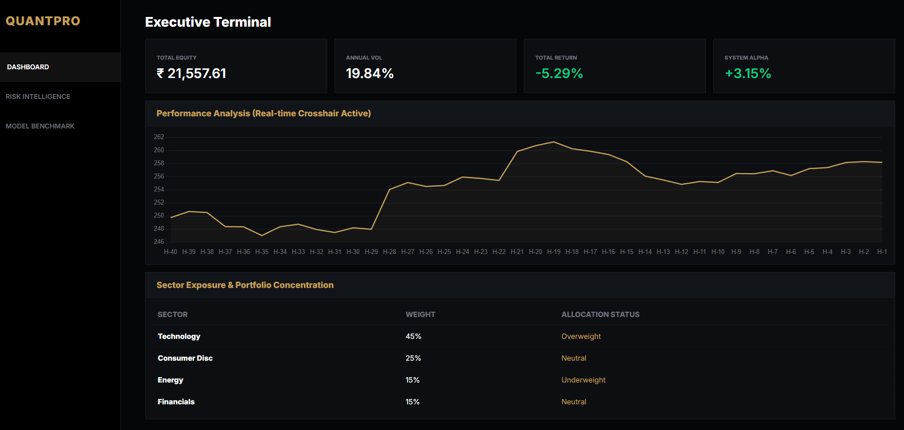
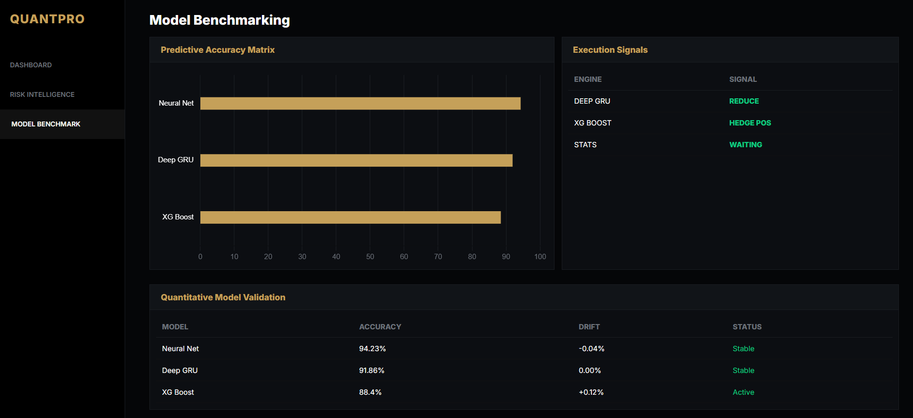

# QUANTOS-REAL-TIME-STOCK-INTELLIGENCE-PIPELINE

**QUANTOS** is an institutional-grade quantitative trading terminal designed for real-time market analysis, predictive risk modeling, and machine learning model validation. By integrating live data feeds with advanced financial mathematics, the pipeline provides a comprehensive view of equity dynamics and systemic risk.

---

## Key Features

* **Executive Terminal:** Real-time tracking of Total Equity, Annualized Volatility, and Jensen's Alpha.
* **Risk Control Matrix:** Deep-dive analytics including **95% Value at Risk (VaR)**, **Sharpe Ratio**, and **CAPM Beta**.
* **Probabilistic Projection:** Monte Carlo simulations using **Geometric Brownian Motion (GBM)** to forecast 40-hour price paths.
* **Quantitative Validation:** Real-time monitoring of Neural Net, Deep GRU, and XGBoost performance with live **Model Drift** detection.

---

## Terminal Interface

### 1. Executive Terminal
The primary dashboard for monitoring portfolio health and alpha generation.


### 2. Risk Control Matrix
Advanced risk parameters and predictive price cones to visualize potential market drawdowns.


### 3. Quantitative Validation
A dedicated engine to benchmark predictive accuracy and algorithmic signal propagation.


---

##  Technical Stack

* **Backend:** Python / Flask
* **Frontend:** HTML5, CSS3 (Modern Dark Terminal UI), JavaScript (ES6+)
* **Data Engine:** yFinance (Live Market Feed)
* **Mathematical Libraries:** NumPy, Pandas (Financial Math & Monte Carlo)
* **Visualization:** Chart.js (Real-time Canvas Rendering)

---

##  Financial Logic & Formulas

The pipeline utilizes several core quantitative methods to process incoming data:

* **Annualized Volatility:** Calculated as $\sigma_{annual} = \sigma_{hourly} \times \sqrt{252 \times 7}$.
* **Monte Carlo Simulation:** Uses the GBM formula to simulate price paths: $S_t = S_0 \exp((\mu - \frac{1}{2}\sigma^2)t + \sigma W_t)$.
* **System Alpha:** Adjusted returns based on the Asset's Beta relative to the S&P 500 benchmark.

---

##  Installation & Setup

1. **Clone the repository:**
   ```bash
   git clone [https://github.com/your-username/quantos-intelligence-pipeline.git](https://github.com/your-username/quantos-intelligence-pipeline.git)
   cd quantos-intelligence-pipeline
   ```

2.  **Install dependencies:**

   ```bash
   pip install -r requirements.txt
   ```

3. **Run the terminal:**

   ```bash
   python app.py

   # Access the local server at http://127.0.0.1:5000.
   ```